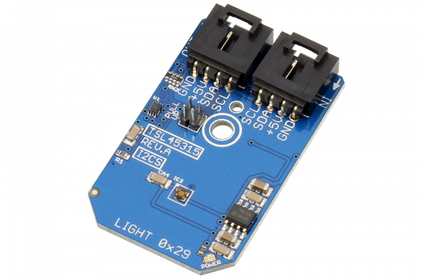

# TSL45315

Manufactured by AMS-TAOS USA Inc., the TSL45315 device provides ambient light sensing (ALS), giving direct lux output that approximates human eye response under a variety of lighting conditions.
This Device is available from www.ncd.io 

[SKU: TSL45315]

(https://store.ncd.io/product/tsl45315-ambient-light-sensor-3-lux-to-220k-lux-i2c-mini-module/)
This Sample code can be used with Arduino.

Hardware needed to interface TSL45315 sensor with Arduino

1. <a href="https://store.ncd.io/product/i2c-shield-for-arduino-nano/">Arduino Nano</a>

2. <a href="https://store.ncd.io/product/i2c-shield-for-arduino-micro-with-i2c-expansion-port/">Arduino Micro</a>

3. <a href="https://store.ncd.io/product/i2c-shield-for-arduino-uno/">Arduino uno</a>

4. <a href="https://store.ncd.io/product/dual-i2c-shield-for-arduino-due-with-modular-communications-interface/">Arduino Due</a>

5. <a href="https://store.ncd.io/product/tsl45315-ambient-light-sensor-3-lux-to-220k-lux-i2c-mini-module/">TSL45315 Ambient Light Sensor</a>

6. <a href="https://store.ncd.io/product/i%C2%B2c-cable/">I2C Cable</a>

TSL45315:

Manufactured by AMS-TAOS USA Inc., the TSL45315 device provides ambient light sensing (ALS), giving direct lux output that approximates human eye response under a variety of lighting conditions.

Applications:

• Extending battery life and providing optimum viewing in diverse lighting conditions.

• Display Backlight Control

• Solid-State and General Lighting andDaylight Harvesting

• Outdoor lighting control

How to Use the TSL45315 Arduino Library

The TSL45315 has a number of settings, which can be configured based on user requirements.
          
1.Address calling:The following command is used to call the address of sensor to begin the transmission.           
          
            tsl.getAddr_TSL45315(TSL45315_DEFAULT_ADDRESS);           // 0x29

2.Integration time setting:The following command is used to set the integration time through Timer Control Register.

            tsl.setTCntrl(TCNTRL_400MS);                    // Tint = 400 ms
                   
